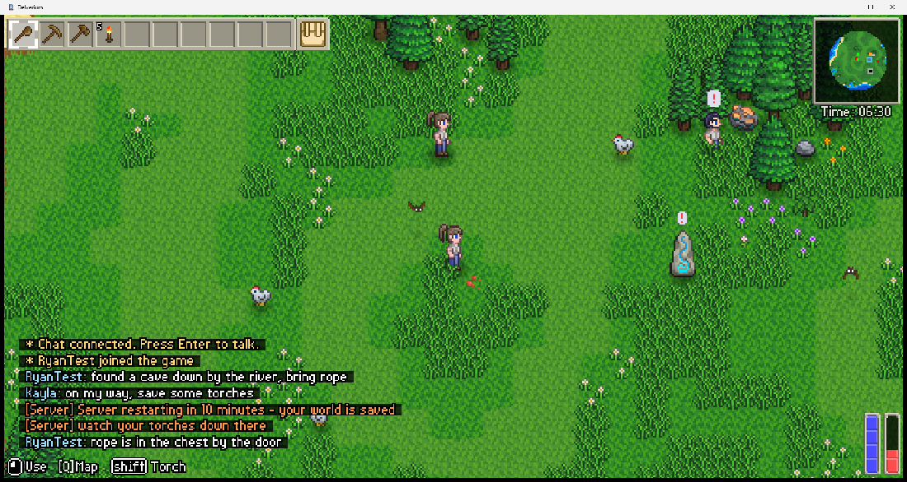
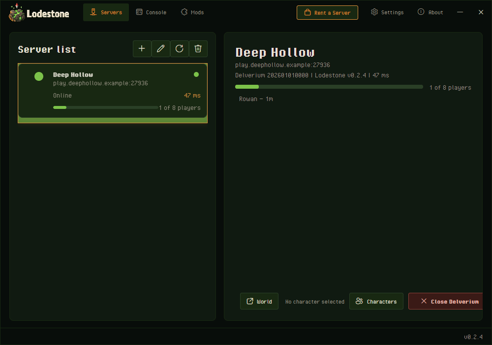

  

  <b>Always-on dedicated servers for <a href="https://store.steampowered.com/app/2710040/">Delverium</a>.</b> 
  Your world keeps running when everyone logs off.

  
  
  
  
  

---

## The problem

A Delverium world lives on one player's machine. Whoever started it has to be sitting at their
computer with the game open, or nobody else can play. When they close the game, the world goes
with them — and if they get a new PC, lose interest, or just go away for a fortnight, so does
everyone's progress.

## What Lodestone does

It moves the world off that machine. A Lodestone server holds the world, stays up around the
clock, and saves as it goes. Your group joins whenever they want, in any order, without rounding
anyone up first.

  
   <em>A live Lodestone server: players in a shared world, in-game chat, and a broadcast sent from outside the game.</em>

---

## Highlights

### The world never logs off
It runs on the server, not on somebody's gaming PC. Play at 3am on a Tuesday without rounding
anyone up or waiting for the host to wake up.

### The whole group fits
Up to eight players, the same as Delverium's own co-op limit. You are not trading players away to
get persistence.

### Your character comes with you
Characters belong to the player and travel between servers. The world belongs to the server and
stays where it is.

### Talk in game
Chat works inside Delverium itself, and the server can post to it — so a scheduled restart or a
heads-up lands where people are actually looking.

### A live map in your browser
Watch the world from a web page: terrain, landmarks and where everyone is, refreshed as things
change. Handy for finding each other, and for seeing what the group built while you were away.

### Run it from anywhere
Roster, console, kick and ban, save, restart — all reachable without logging into the machine
itself.

### Light on hardware
No graphics card, no monitor, no desktop session. It is happy on a spare box or a small rented
one.

<!-- Add the Lodestone app capture here once the branded build is shot:
     

       
     

     Must be a real capture of the shipped build, and must not show an internal test server name. -->

---

## How it works

Three pieces, and you only ever touch the middle one.

**The server** holds the world, keeps it saved, and answers to the group's admin tools.

**The Lodestone app** is a small Windows app you run instead of launching Delverium yourself.
Save a server address once, pick your character, hit Connect.

**Your copy of Delverium** is bought and updated from Steam exactly as normal. Lodestone does not
replace it and does not ship any part of it.

> **Every player needs the Lodestone app.** Delverium has no way to reach a server like this on
> its own, so the app is how anyone gets in — including you. It is a one-time install per person,
> and after that connecting is two clicks. Normal Delverium co-op still works whenever you want
> it.

---

## Getting a server

### Rent one

The shortest path is [Delverium hosting from SurvivalServers](https://www.survivalservers.com/services/game_servers/delverium/?utm_source=github&utm_medium=readme_install&utm_campaign=lodestone).
Lodestone is already installed and kept up to date for you, the ports are open, and the control
panel gives your players a ready-made connect link.

### Run your own

Downloads and setup instructions live in
[LodestoneServer](https://github.com/HumanGenome/LodestoneServer). You will need a Windows
machine, a copy of Delverium's files on it, and a couple of open ports.

### Joining as a player

1. Install the Lodestone app.
2. Paste in the server address your host gave you.
3. Pick a character and click Connect.

The app remembers your servers and your characters between sessions.

---

## Ports

Everything derives from one base port, so you pick a number and the rest follow.

| Port | Used for | Needed? |
|---|---|---|
| base — default `27016` | Gameplay. This is the one players connect to | **Required** |
| base + 1 | Server status, so the app can show whether it is up | **Required** |
| base + 3 | Admin console | Optional |
| base + 4 | Admin tools | Optional |
| base + 5 | The browser map | Optional |

---

## Downloads and changelog

- **[Latest release](https://github.com/HumanGenome/Lodestone/releases/latest)** — the Lodestone
  app, for players
- **[LodestoneServer releases](https://github.com/HumanGenome/LodestoneServer/releases/latest)** —
  the server package, for hosts
- **[Full changelog](https://github.com/HumanGenome/LodestoneServer/blob/main/CHANGELOG.md)** —
  every version, server and client side by side

Both halves share a version number, so a given version means the same build whichever side you
are looking at.

  <em>Lodestone is in development for Delverium's Early Access launch on 22 September 2026. 
  There are no public downloads yet — releases will appear here.</em>

---

## FAQ

### Do all my friends need the app?
Yes, and so do you. Delverium cannot reach a Lodestone server without it. It installs once per
person and takes a minute.

### Do I need to leave my PC on?
No. That is the entire point. Once the world is on a server, your machine has nothing to do
with it.

### Does this change my copy of Delverium?
You still buy, run and update Delverium through Steam as normal. The app handles its own setup
and leaves your ordinary single-player and co-op games alone.

### What happens to my character?
It stays yours. Characters travel between servers with you; a world stays on the server it was
made on.

### Can I move a world between servers?
Yes. World saves are ordinary files, so a host can copy one across.

### How many players?
Eight, matching Delverium's own co-op limit.

### Is this an official Delverium feature?
No. Lodestone is an independent community project. Sagestone Games does not ship dedicated
servers for Delverium, which is why this exists.

### Where do I report a problem?
[Open an issue](https://github.com/HumanGenome/Lodestone/issues). If you rent a managed server,
your host handles anything about billing or the control panel.

---

## Contributing

Bug reports and feature requests are welcome — see [CONTRIBUTING.md](CONTRIBUTING.md). Security
issues go through [private reporting](.github/SECURITY.md), never a public issue.

## Community note

Lodestone is an independent community project. It is not affiliated with, endorsed by, or
supported by Sagestone Games. Delverium is their game — buy it on
[Steam](https://store.steampowered.com/app/2710040/).

## License

MIT — see [LICENSE](LICENSE).
