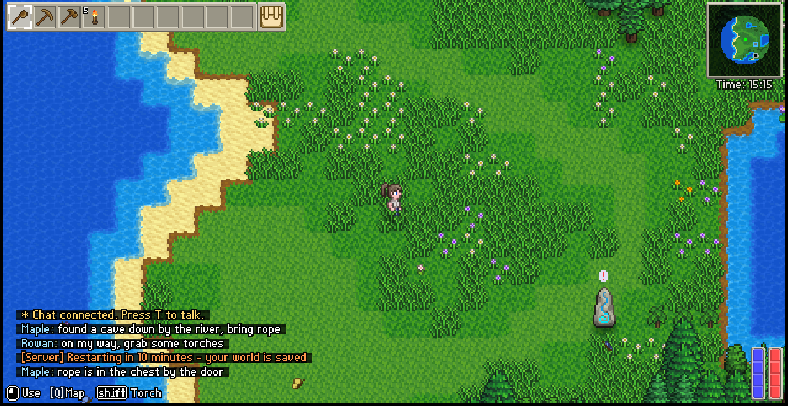

  

  <b>Always-on dedicated servers for <a href="https://store.steampowered.com/app/2710040/">Delverium</a>.</b> 
  Your world keeps running when everyone logs off.

  
  
  
  
  

  

Save a server's address once. From then on it is one glance to see who is playing and one
click to join them — and the world stays up around the clock, on the server, no matter
whose PC is off.

Every player runs the Lodestone app, including whoever runs the server — Delverium cannot
reach a dedicated server on its own, so the app is how anyone gets in. It installs once per
person and takes a minute. Your copy of Delverium is bought and updated from Steam exactly
as normal; Lodestone does not replace it and ships no part of it.

- Up to eight players, Delverium's own co-op limit.
- Characters travel with you between servers. The world stays on the server.
- Roster, console, kick and ban, save, restart — all without touching the machine.
- 328 MB installed, a few percent of one CPU core when idle. If something is wrong, the
  server refuses to start and tells you why.

  
   <em>The live map in your browser — terrain, landmarks and where everyone is, served straight from the running server.</em>

  
   <em>Chat opens on <b>T</b>, inside Delverium itself — the game has no chat of its own. The server can post to the same feed.</em>

---

## Getting a server

**Rent one.** [Delverium hosting from SurvivalServers](https://www.survivalservers.com/services/game_servers/delverium/?utm_source=github&utm_medium=readme_install&utm_campaign=lodestone)
comes with Lodestone installed and kept up to date, the ports open, and a connect link
ready to hand to your players.

**Run your own.** Downloads and setup live in
[LodestoneServer](https://github.com/HumanGenome/LodestoneServer). You will need a Windows
machine, a copy of Delverium's files on it, and a couple of open ports.

**Joining as a player:**

1. Install the Lodestone app.
2. Paste in the address your host gave you.
3. Click Connect. The app readies Delverium and takes you in — characters are made in the
   game, the same as always.

## Downloads

- **[Latest release](https://github.com/HumanGenome/Lodestone/releases/latest)** — the
  Lodestone app, for players
- **[LodestoneServer releases](https://github.com/HumanGenome/LodestoneServer/releases/latest)** —
  the server package, for hosts
- **[Changelog](https://github.com/HumanGenome/LodestoneServer/blob/main/CHANGELOG.md)** —
  every version, app and server side by side

  <em>Lodestone is in development for Delverium's Early Access launch on 22 September 2026. 
  There are no public downloads yet — releases will appear here.</em>

## FAQ

**Do all my friends need the app?** Yes, and so do you. Delverium cannot reach a Lodestone
server without it. It installs once per person, and normal Delverium co-op still works
whenever you want it.

**Do I need to leave my PC on?** No. That is the entire point — once the world is on a
server, your machine has nothing to do with it.

**Does this change my copy of Delverium?** No. You buy, run and update Delverium through
Steam as normal, and your ordinary single-player and co-op games are untouched.

**Can I move a world between servers?** Yes. World saves are ordinary files, so a host can
copy one across.

**Is this an official Delverium feature?** No. Lodestone is an independent community
project. Sagestone Games does not ship dedicated servers for Delverium, which is why this
exists.

**Where do I report a problem?** [Open an issue](https://github.com/HumanGenome/Lodestone/issues).
If you rent a managed server, your host handles billing and control-panel questions.

---

Bug reports and feature requests are welcome — see [CONTRIBUTING.md](CONTRIBUTING.md).
Security issues go through [private reporting](.github/SECURITY.md), never a public issue.

Lodestone is not affiliated with, endorsed by, or supported by Sagestone Games. Delverium
is their game — [buy it on Steam](https://store.steampowered.com/app/2710040/).

MIT — see [LICENSE](LICENSE).
